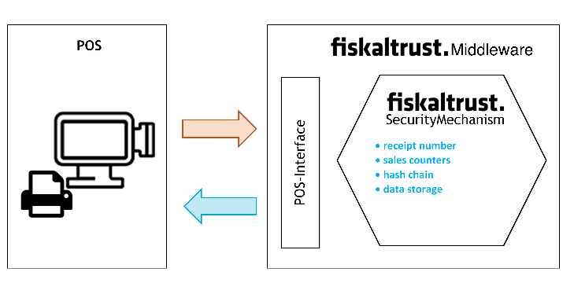
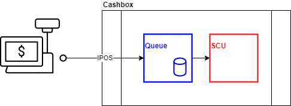

# Compliance-as-a-Service

Als Poscreator erhalten Sie Compliance-as-a-Service, indem Sie fiskaltrust in Ihr Produkt integrieren. Durch die Übermittlung jedes Beleges, jeder Transaktion oder jeder relevanten Aktion an die fiskaltrust.Middleware vor deren Abschluss wird diese Konformität als Service bereitgestellt. Die fiskaltrust.Middleware bietet eine stabile Schnittstelle zu verschiedenen Technologien für das vom Poscreator erstellte Possystem und bietet einen einfachen Berührungspunkt zwischen Possystem und Fiskaltrust-Middleware.

                                

Diese Lösung macht die fiskaltrust.Middleware zu einem wesentlichen Bestandteil des Possystems und damit auch zu dessen Instanz zur Registrierkasse.

Die fiskaltrust.Middleware verarbeitet einige der wichtigsten Datenfelder auf dem Beleg. Die Belegnummer als eindeutige Identifikation eines von der Registrierkasse übermittelten Beleges wird von der fiskaltrust.Middleware erstellt, um sicherzustellen, dass jeder Beleg von ihr verarbeitet wird.

Die Konformität wird durch die Kombination mehrerer Methoden und Komponenten erreicht.

Zunächst stellt die fiskaltrust.Middleware sicher, dass alle Belege von einem Dritten neben dem Poscreator und dem Posoperator verarbeitet werden. Dies ist die organisatorische Implementierung der Sicherheit.

Als technische Implementierung der Sicherheit wird jeder Request und auch jede Response gehasht, wodurch die Datenintegrität der Anforderungen und Antworten sichergestellt wird. Um Unveränderlichkeit zu gewährleisten, wird ein weiterer Hash-Wert generiert, der sich auf den gesamten Anforderungs-Antwort-Zyklus bezieht, einschließlich der Identifizierung des Zyklus, des Betriebszeitpunkts, der vom Menschen lesbaren Belegnummer und der Hash-Werte von Anforderung, Antwort und vorherigem Empfang, der so genannte Belegs-Hash-Wert. Diese Verkettung des Empfangs-Hash-Werts bietet Unveränderlichkeit und bietet die Möglichkeit, alle Änderungen und auch das Löschen bei jeder vom Possystem bereitgestellten Aktion zu erkennen.

 

 

Um das Risiko eines Angriffs auf die Kette ab dem letzten nicht verketteten Hashwert zu begrenzen, bietet fiskaltrust einen Mechanismus, der die aktuellen Daten in die fiskaltrust-Cloud spiegelt. Dieser Datenspiegel bietet die Möglichkeit, Angriffe zu erkennen, die an der Registrierkasse selbst nicht erkennbar wären.

Als letzte Komponente des fiskaltrust-Sicherheitsmechanismus bietet die fiskaltrust.Middleware auch marktbezogene Sicherheitsmechanismen.

Um für verschiedene Plattformen und Betriebssysteme so offen wie möglich zu sein und das Versprechen zu erfüllen, als stabile Schnittstelle zum Possystem zu fungieren, folgt die fiskaltrust.Middleware einer strengen Architektur.

 

  

 

Der von der CashboxId identifizierte Konfigurationscontainer kann in verschiedene Plattformen und Betriebssysteme integriert werden. Die Verwaltung der Konfiguration und des Status dieser Komponenten erfolgt im marktbezogenen fiskaltrust-Portal. Der fiskaltrust-Sicherheitsmechanismus wird von der Queue-Komponente und der SCU-Komponente (Signaturerstellungseinheit) bereitgestellt, die die Bindung an die marktbezogenen Sicherheitsmechanismus-Anforderungen darstellen.

## fiskaltrust Produkte & Features

[Compliance-as-a-Service Produkte](products/README.md)

[Compliance-as-a-Service Features](features/README.md)

**Hinweis:** Die Schnittstellenbeschreibung für den Zugriff auf den fiskaltrust-Sicherheitsmechanismus ist die IPOS-Schnittstelle, die in einem eigenen github repository öffentlich zugänglich ist: 

https://github.com/fiskaltrust/interface-doc