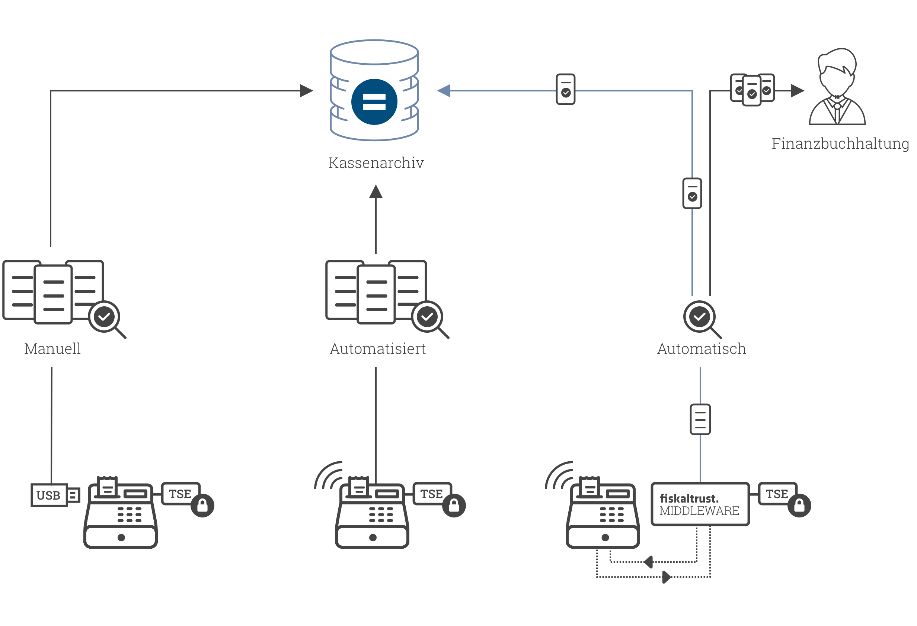

# Audicon Kassenarchiv Online (AKO) (in Entwicklung)

**Produktnummer:** 4445-040020

Das AKO ist grundsätzlich unabhängig von unserem Basis-Produkt, der fiskaltrust.Middleware. Es archiviert Dateien, die manuell oder über eine API hochgeladen werden können. Dabei handelt es sich um strukturierten Tagesabschluss-Daten (DSFinV-K Format), TSE TAR-Files und andere Dateien (Blob-Daten), wie zum Beispiel PDF-Dateien mit Verfahrensdokumentation oder aktuellen Preislisten. Alle hochgeladenen Daten werden mithilfe eines unveränderbaren Speichers im Backend, entsprechend den gesetzlichen Vorgaben in deutschen Rechenzentren, über einen Zeitraum von 12 Jahren im Original archiviert.

                               

## Optionen zum Daten-Upload

In der folgenden Skizze werden die Optionen zum Hochladen der Daten ins AKO dargestellt. Die Daten können dabei entweder manuell oder über eine API hochgeladen werden. 

Der linke Strang stellt die Option zum manuellen Upload der Tagesabschussdaten, TSE-TAR Files und anderen Dateien dar. Dabei werden die Tagesabschuss-Daten und TSE-TAR Files aus dem Kassensystem zum Beispiel auf einen USB-Stick exportiert und von dort mit Hilfe des AKO Unser-Interface über eine File-Drop Funktion im Browser hochgeladen. Der mittlere und rechte Strang stellen den Upload der Tagesabschuss-Daten, TSE-TAR Files und anderen Dateien über die AKO API dar. Dabei wird grundsätzlich unterschieden, ob das Kassensoftware unser Basis-Produkt, die fiskaltrust.Middleware integriert hat (rechter Strang) oder nicht integriert hat (mittlerer Strang). Wurde die fiskaltrust.Middleware nicht integriert, kann das Kassensystem oder ein anderes Programm die AKO API direkt benutzen um die Daten automatisiert hochzuladen. Wurde die fiskaltrust.Middleware integriert, so ist die Einbindung der AKO API nicht notwendig, denn hierbei werden die Tagesabschuss-Daten und TSE-TAR Files automatisch von der fiskaltrust.Middleware übertragen. Andere, nicht regelmäßig hochzuladende Dateien, wie zum Beispiel Preislisten oder Verfahrensdokumentationen können ebenfalls mit Hilfe der fiskaltrust.Middleware hochgeladen werden. Hierzu stellen wir Ihnen einen Helper namens fiskaltrust.FileUploader zur Verfügung. Der Helper ermöglicht den Upload über das Ablegen der Files in ein extra dafür konfigurierten, lokalen Ordner.

### Manueller Datenupload

Folgende Daten können manuell über einen File-Drop in das Archiv hochgeladen werden: 

- Tagesabschussdaten (DSFinV-K Format)
- TSE TAR-Files
- Andere Dateien (Blob-Files, z.B. PDF)

Beim Upload der Tagesabschuss-Daten findet eine technische Validierung der DSFinV-K Dateien statt.

### Automatisierter Daten-Upload (über API)

Folgende Daten können über einen automatisierten Daten-Upload via API vom Kassensystem oder einem anderen Programm in das Archiv hochgeladen werden: 

- Tagesabschussdaten (DSFinV-K Format)
- TSE TAR-Files
- Andere Dateien (Blob-Files, z.B. PDF)

Beim Upload der Tagesabschuss-Daten findet eine technische Validierung der DSFinV-K Dateien statt.

### Automatischer Daten-Upload (mit Hilfe der fiskaltrust.Middleware)

Folgende Daten werden über einen automatischen Daten-Upload via fiskaltrust.Middleware in das Archiv hochgeladen:

- Tagesabschuss-Daten (DSFinV-K Format) - werden automatisch aus den Rohdaten (Belegdaten) von der fiskaltrust.Middleware generiert
- TSE TAR-Files - werden automatisch und regelmäßig von der fiskaltrust.Middlware aus der TSE geladen
- Andere Dateien (Blob-Files, z.B. PDF) - mit den fiskaltrust.FileUploader Helper via Ablage in einen lokalen Ordner

Eine Validierung der DSFinV-K Dateien ist hierbei nicht notwendig, da diese direkt aus den Rohdaten durch fiskaltrust generiert werden.

## Features:

- Nutzung für Kassensyteme mit und ohne integrierter fiskaltrust.Middleware möglich
- Revisionssichere Archivierung manuell hochgeladener Daten (Tagesabschuss-Daten, TSE-TAR Files, Blob-FIles) über nutzerfreundliche File-Drop Funktion mittels Browser (keine Authentifizierung notwendig)
- API zur Automatisierung des Uploads
- Einbindung des File-Drop in die Website des Kassenhändlers möglich (HTML + JS) - siehe [GitHub Repo](https://github.com/fiskaltrust/ako-upload-page)
- Technische Validierung der Hochgeladenen DSFinV-K Dateien (Tagesabschuss-Daten)
- Upload von Blob-Files aus einem lokalen Verzeichnis über den fiskaltrust.FileUploader Helper bei integrierter fiskaltrust.Middleware möglich
- Upload vor Kauf möglich, Bezahlung erst für den späteren Zugriff auf die Daten notwendig
- Archivierung erfolgt im deutschen Rechenzentrum
- Mandantenfähiger Zugriff auf die Daten über WEB Portal und über generierte Links mit Tokens zur einfachen Übermittlung an den Steuerberater oder Prüfer
- Daten-Export mit zeitlicher Filterung pro Kasse und pro Filiale
  

## Verkaufseinheit

Verkauf pro Filiale pro Jahr
